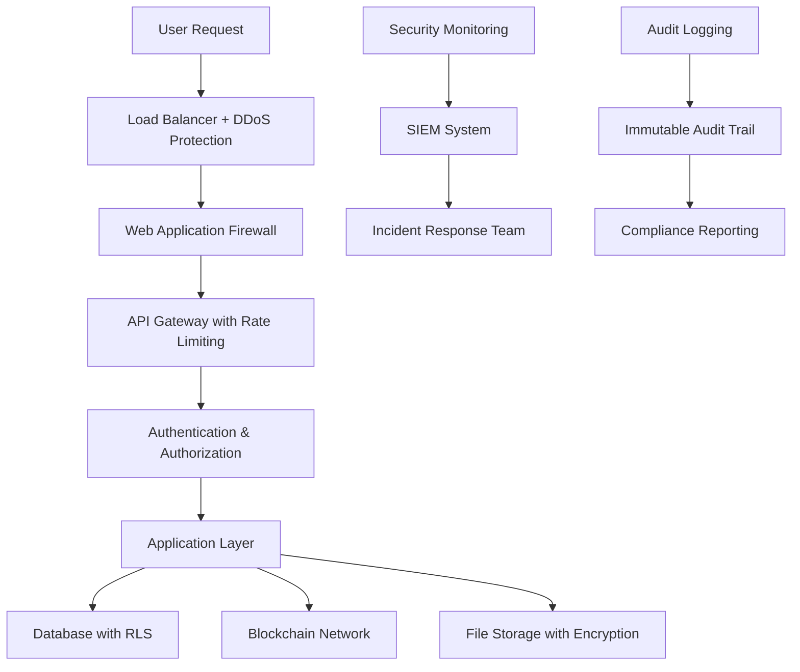

# Security Policies and Compliance Framework
## Kenya e-Government Procurement (e-GP) Platform

### Table of Contents
1. [Security Overview](#security-overview)
2. [Data Protection Policies](#data-protection-policies)
3. [AI Security and Safety](#ai-security-and-safety)
4. [Access Control Policies](#access-control-policies)
5. [Audit and Compliance](#audit-and-compliance)
6. [Incident Response](#incident-response)
7. [Privacy Policies](#privacy-policies)
8. [Blockchain Security](#blockchain-security)

---

## Security Overview

### Security Architecture



### Core Security Principles

#### 1. **Defense in Depth**
- **Layer 1**: Network security (Firewall, DDoS protection)
- **Layer 2**: Application security (WAF, input validation)
- **Layer 3**: Authentication (Multi-factor, biometric)
- **Layer 4**: Authorization (Role-based access control)
- **Layer 5**: Data encryption (At rest and in transit)
- **Layer 6**: Blockchain integrity (Immutable audit trails)

#### 2. **Zero Trust Architecture**
- No implicit trust for any user or device
- Continuous verification of all access requests
- Least privilege access controls
- Microsegmentation of network resources

#### 3. **Privacy by Design**
- Data minimization principles
- Purpose limitation for data collection
- Built-in privacy controls
- User consent management

---

## Data Protection Policies

### Multi-Jurisdictional Compliance

#### **GDPR (European Union) Compliance** 🇪🇺
```typescript
GDPRCompliance: {
  legalBasis: [
    "Legitimate Interest (Art. 6.1.f)",
    "Contractual Necessity (Art. 6.1.b)",
    "Legal Obligation (Art. 6.1.c)"
  ],
  
  dataSubjectRights: {
    rightToAccess: "Users can download all their data",
    rightToRectification: "Users can update personal information",
    rightToErasure: "Data deletion upon request (with legal exceptions)",
    rightToPortability: "Export data in machine-readable format",
    rightToRestriction: "Limit processing for specific purposes",
    rightToObject: "Opt-out of data processing"
  },
  
  implementation: {
    dataProtectionOfficer: "dpo@procurechain.co.ke",
    privacyNotices: "Clear, concise privacy information",
    consentManagement: "Granular consent controls",
    breachNotification: "72-hour notification to supervisory authority",
    dataMinimization: "Collect only necessary data",
    purposeLimitation: "Use data only for stated purposes"
  }
}
```

#### **Kenya Data Protection Act 2019** 🇰🇪
```typescript
KenyaDataProtection: {
  registrationCompliance: {
    dataControllerRegistration: "Registered with Office of Data Protection Commissioner",
    registrationNumber: "DPC/REG/2024/XXX",
    annualCompliance: "Annual compliance reporting to ODPC"
  },
  
  localDataRequirements: {
    dataLocalization: "Personal data of Kenyan citizens stored in Kenya",
    crossBorderTransfers: "Adequate protection standards for transfers",
    governmentAccess: "Controlled access for law enforcement"
  },
  
  rightsOfDataSubjects: {
    informationAccess: "Right to know how data is processed",
    correctionRight: "Right to correct inaccurate data",
    deletionRight: "Right to delete personal data",
    objectionRight: "Right to object to processing"
  }
}
```

#### **US Standards (CCPA, SOC 2)** 🇺🇸
```typescript
USCompliance: {
  ccpa: {
    applicability: "California consumers' personal information",
    consumerRights: [
      "Right to know about personal information collected",
      "Right to delete personal information",
      "Right to opt-out of sale of personal information",
      "Right to non-discrimination"
    ]
  },
  
  soc2: {
    trustServicesCriteria: [
      "Security", "Availability", "Processing Integrity",
      "Confidentiality", "Privacy"
    ],
    auditFrequency: "Annual Type II audit",
    reportAccess: "Available to customers upon request"
  }
}
```

### Data Classification and Handling

#### **Classification Levels**
```typescript
DataClassification: {
  public: {
    description: "Information intended for public disclosure",
    examples: ["Tender announcements", "Public documents", "Terms of service"],
    protection: "Standard web security"
  },
  
  internal: {
    description: "Information for internal organizational use",
    examples: ["Budget allocations", "Internal memos", "System configurations"],
    protection: "Access controls, encryption in transit"
  },
  
  confidential: {
    description: "Sensitive business information",
    examples: ["Bid evaluations", "Supplier negotiations", "Contract terms"],
    protection: "Strong encryption, audit logging, restricted access"
  },
  
  restricted: {
    description: "Highly sensitive information requiring special protection",
    examples: ["Personal identification", "Financial records", "Security keys"],
    protection: "End-to-end encryption, blockchain hashing, audit trails"
  }
}
```

#### **Data Retention Policies**
```typescript
RetentionPolicies: {
  procurementRecords: {
    period: "7 years after contract completion",
    legalBasis: "Public Procurement Regulatory Authority requirements",
    disposal: "Secure deletion with certificate of destruction"
  },
  
  auditLogs: {
    period: "10 years",
    legalBasis: "Government audit requirements",
    storage: "Immutable blockchain storage"
  },
  
  personalData: {
    period: "As long as legally required or user consents",
    reviewCycle: "Annual review for necessity",
    anonymization: "After retention period"
  },
  
  financialRecords: {
    period: "7 years",
    legalBasis: "Tax and accounting requirements",
    encryption: "AES-256 throughout lifecycle"
  }
}
```

---

## AI Security and Safety

### AI-Powered Features Security

#### **Supplier Risk Assessment AI** 🤖
```typescript
AIRiskAssessment: {
  securityMeasures: {
    dataPrivacy: "Only aggregated, anonymized data used for training",
    modelSecurity: "Encrypted model storage and execution",
    biasDetection: "Regular algorithmic bias testing",
    explainability: "Transparent decision-making process"
  },
  
  safetyProtocols: {
    humanOversight: "All AI recommendations reviewed by humans",
    fallbackProcedures: "Manual assessment if AI fails",
    auditability: "Complete log of AI decision factors",
    continuousMonitoring: "Real-time performance monitoring"
  },
  
  ethicalGuidelines: {
    fairness: "No discrimination based on protected characteristics",
    transparency: "Clear explanation of AI decision factors",
    accountability: "Human responsibility for final decisions",
    privacy: "Minimal data collection for AI processing"
  }
}
```

#### **Procurement Intelligence AI** 📊
```typescript
ProcurementIntelligence: {
  marketAnalysis: {
    dataSources: "Public procurement data only",
    privacyPreservation: "Differential privacy for sensitive analysis",
    accuracy: "Regular validation against known outcomes",
    bias: "Multi-dimensional fairness testing"
  },
  
  predictionSafety: {
    confidenceThresholds: "Only high-confidence predictions surfaced",
    uncertaintyQuantification: "Clear indication of prediction reliability",
    adversarialProtection: "Robust against data manipulation",
    modelValidation: "Cross-validation with holdout datasets"
  }
}
```

#### **AI Governance Framework** 🛡️
```typescript
AIGovernance: {
  developmentPrinciples: [
    "Privacy by design in AI systems",
    "Explainable AI for procurement decisions", 
    "Human-in-the-loop for critical decisions",
    "Regular bias and fairness audits",
    "Transparent data usage policies"
  ],
  
  monitoringProtocols: {
    performanceMetrics: "Accuracy, fairness, robustness",
    driftDetection: "Model performance degradation alerts",
    adversarialTesting: "Regular security testing",
    ethicalReview: "Quarterly ethics committee review"
  },
  
  incidentResponse: {
    biasDetected: "Immediate model suspension and investigation",
    dataLeak: "AI system shutdown and forensic analysis",
    maliciousInput: "Input sanitization and threat analysis",
    modelCompromise: "Model rollback and security audit"
  }
}
```

### AI Safety Compliance

#### **IEEE Standards Compliance**
- **IEEE 2857**: Framework for privacy engineering
- **IEEE 2859**: Ethical design processes for AI
- **IEEE 2851**: Algorithmic accountability

#### **EU AI Act Compliance**
- **Risk Classification**: High-risk AI system protocols
- **Quality Management**: Comprehensive AI QM system
- **Data Governance**: Bias detection and mitigation
- **Human Oversight**: Human-in-the-loop requirements

---

## Access Control Policies

### Role-Based Access Control (RBAC)

#### **Role Hierarchy**
```typescript
RoleHierarchy: {
  admin: {
    permissions: "Full system access",
    dataAccess: "All data including personal information",
    auditability: "All actions logged and monitored",
    restrictions: "Multi-factor authentication required"
  },
  
  buyer: {
    permissions: "Tender creation, evaluation, award",
    dataAccess: "Own tenders and related bids",
    restrictions: "Department-specific budget limits"
  },
  
  supplier: {
    permissions: "Bid submission, document upload",
    dataAccess: "Own bids and public tender information",
    restrictions: "Verification level determines access"
  },
  
  evaluator_finance: {
    permissions: "Financial evaluation of bids",
    dataAccess: "Financial data for assigned tenders",
    restrictions: "Read-only access to personal information"
  },
  
  evaluator_technical: {
    permissions: "Technical evaluation of bids",
    dataAccess: "Technical documents for assigned tenders",
    restrictions: "Cannot access financial information"
  },
  
  supply_chain_professional: {
    permissions: "Supply chain review and validation",
    dataAccess: "Tender requirements and specifications",
    restrictions: "Review-only, cannot modify tenders"
  },
  
  auditor: {
    permissions: "Audit log access and compliance review",
    dataAccess: "All audit trails and compliance data",
    restrictions: "Read-only access, cannot modify records"
  }
}
```

#### **Attribute-Based Access Control (ABAC)**
```typescript
ABACPolicies: {
  timeBasedAccess: {
    tenderEvaluation: "Access only during evaluation period",
    bidSubmission: "Access only before deadline",
    systemMaintenance: "Restricted during maintenance windows"
  },
  
  locationBasedAccess: {
    governmentNetworks: "Enhanced access from government IP ranges",
    foreignAccess: "Additional verification for international access",
    mobileAccess: "Restricted sensitive operations on mobile"
  },
  
  contextualAccess: {
    highValueTenders: "Additional approvals for tenders >10M KES",
    emergencyProcurement: "Special procedures for urgent tenders",
    internationalTenders: "Enhanced compliance for international bids"
  }
}
```

### Multi-Factor Authentication (MFA)

#### **Authentication Factors**
```typescript
MFARequirements: {
  standard: {
    factors: ["Password", "SMS OTP", "Email verification"],
    applicability: "All users",
    timeout: "Session expires after 8 hours inactivity"
  },
  
  elevated: {
    factors: ["Password", "Authenticator App", "Biometric"],
    applicability: "Admins, high-value operations",
    timeout: "Session expires after 2 hours inactivity"
  },
  
  critical: {
    factors: ["Password", "Hardware Token", "Biometric", "Admin Approval"],
    applicability: "System configuration, audit log access",
    timeout: "Session expires after 30 minutes inactivity"
  }
}
```

---

## Audit and Compliance

### Comprehensive Audit Framework

#### **Audit Categories**
```typescript
AuditCategories: {
  systemAudit: {
    scope: "All system configuration changes",
    retention: "10 years",
    storage: "Immutable blockchain ledger",
    monitoring: "Real-time alerts for critical changes"
  },
  
  userAudit: {
    scope: "All user actions and data access",
    retention: "7 years",
    details: "User ID, timestamp, action, IP address, user agent",
    privacy: "Personal data pseudonymized"
  },
  
  dataAudit: {
    scope: "All data creation, modification, deletion",
    retention: "7 years", 
    integrity: "Cryptographic hashing of all changes",
    verification: "Regular integrity checks"
  },
  
  complianceAudit: {
    scope: "Regulatory compliance monitoring",
    frequency: "Continuous automated + quarterly manual",
    reporting: "Monthly compliance reports to management",
    escalation: "Immediate alerts for compliance violations"
  }
}
```

#### **Regulatory Compliance Matrix**

| Regulation | Compliance Status | Last Audit | Next Review |
|------------|------------------|------------|-------------|
| **Kenya PPRA** | ✅ Compliant | 2024-03-15 | 2024-06-15 |
| **Kenya Data Protection Act** | ✅ Compliant | 2024-03-01 | 2024-06-01 |
| **GDPR** | ✅ Compliant | 2024-02-15 | 2024-08-15 |
| **ISO 27001** | ✅ Certified | 2024-01-15 | 2025-01-15 |
| **SOC 2 Type II** | ✅ Certified | 2024-02-01 | 2025-02-01 |
| **PCI DSS** | ✅ Compliant | 2024-03-01 | 2024-09-01 |

### Blockchain Audit Trail

#### **Immutable Logging**
```typescript
BlockchainAudit: {
  transactionTypes: [
    "Tender Creation", "Bid Submission", "Evaluation",
    "Award Decision", "Contract Signing", "Payment Processing"
  ],
  
  dataIntegrity: {
    hashing: "SHA-256 cryptographic hashing",
    timestamping: "RFC 3161 compliant timestamps",
    consensus: "Multi-node validation",
    immutability: "Cannot be altered after blockchain confirmation"
  },
  
  auditCapabilities: {
    completeHistory: "Full transaction history for any entity",
    timelineReconstruction: "Reconstruct exact sequence of events",
    integrityVerification: "Verify document hasn't been tampered",
    nonRepudiation: "Cryptographic proof of actions"
  }
}
```

---

## Incident Response

### Incident Classification

#### **Severity Levels**
```typescript
IncidentSeverity: {
  critical: {
    definition: "System unavailable or data breach affecting >1000 users",
    responseTime: "15 minutes",
    escalation: "Immediate C-level notification",
    communication: "Public incident notice within 2 hours"
  },
  
  high: {
    definition: "Significant functionality impacted or potential security issue",
    responseTime: "1 hour",
    escalation: "Management notification within 30 minutes",
    communication: "Customer notification within 4 hours"
  },
  
  medium: {
    definition: "Limited functionality impact or minor security concern",
    responseTime: "4 hours",
    escalation: "Team lead notification",
    communication: "Internal notification"
  },
  
  low: {
    definition: "Minimal impact or informational security alert",
    responseTime: "24 hours",
    escalation: "Standard ticket queue",
    communication: "Routine reporting"
  }
}
```

#### **Response Procedures**
```typescript
IncidentResponse: {
  detection: {
    automaticAlerts: "SIEM system monitors for anomalies",
    userReporting: "Incident reporting form on platform",
    externalReporting: "Third-party security research disclosure",
    monitoring: "24/7 SOC monitoring"
  },
  
  containment: {
    immediate: "Isolate affected systems within 15 minutes",
    assessment: "Determine scope and impact",
    preservation: "Preserve evidence for forensic analysis",
    communication: "Incident team coordination"
  },
  
  eradication: {
    rootCause: "Identify and eliminate the source",
    systemCleaning: "Remove malicious artifacts",
    patching: "Apply security patches",
    testing: "Verify systems are clean"
  },
  
  recovery: {
    systemRestore: "Restore from clean backups",
    monitoring: "Enhanced monitoring during recovery",
    validation: "Verify normal operations",
    documentation: "Complete incident documentation"
  },
  
  postIncident: {
    lessonsLearned: "Conduct post-incident review",
    policyUpdates: "Update security policies as needed",
    training: "Additional training if required",
    reporting: "Submit regulatory reports if required"
  }
}
```

### Data Breach Response

#### **Breach Notification Timeline**
```typescript
BreachNotification: {
  internal: {
    discovery: "Immediate notification to incident team",
    assessment: "Risk assessment within 4 hours",
    management: "C-level notification within 8 hours",
    legal: "Legal team consultation within 12 hours"
  },
  
  regulatory: {
    dataCommissioner: "72 hours (Kenya DPA)",
    supervisoryAuthority: "72 hours (GDPR)",
    lawEnforcement: "As required by local law",
    industryBodies: "As required by sector regulations"
  },
  
  customerNotification: {
    affectedUsers: "Without undue delay",
    publicNotice: "If high risk to rights and freedoms",
    mediaRelations: "Coordinated public communications",
    supportResources: "Customer support and remediation"
  }
}
```

---

## Privacy Policies

### Personal Data Processing

#### **Data Subject Rights Implementation**
```typescript
DataSubjectRights: {
  rightToAccess: {
    process: "Submit request via privacy portal",
    timeline: "Response within 30 days",
    format: "Machine-readable JSON export",
    verification: "Multi-factor identity verification"
  },
  
  rightToRectification: {
    process: "Self-service profile updates",
    timeline: "Immediate for most data",
    verification: "Document verification for identity changes",
    notification: "Notify third parties of corrections"
  },
  
  rightToErasure: {
    process: "Submit deletion request with justification",
    timeline: "30 days processing time",
    exceptions: "Legal obligations and audit requirements",
    confirmation: "Deletion certificate provided"
  },
  
  rightToPortability: {
    process: "Export data in standard formats",
    formats: ["JSON", "CSV", "XML"],
    scope: "Personal data provided by user",
    security: "Encrypted export with access controls"
  }
}
```

#### **Consent Management**
```typescript
ConsentManagement: {
  granularConsent: {
    categories: [
      "Essential cookies (required)",
      "Analytics cookies (optional)",
      "Marketing communications (optional)",
      "Data sharing with partners (optional)"
    ],
    controls: "Individual on/off toggles",
    withdrawal: "Easy withdrawal mechanism"
  },
  
  consentRecords: {
    timestamp: "When consent was given",
    version: "Which privacy policy version",
    method: "How consent was obtained",
    ipAddress: "Source IP for consent",
    retention: "Consent records kept for 7 years"
  }
}
```

### Cookie and Tracking Policy

#### **Cookie Classification**
```typescript
CookiePolicy: {
  essential: {
    purpose: "Website functionality and security",
    examples: ["Session cookies", "Security tokens", "Load balancing"],
    consent: "Required for service, no opt-out",
    retention: "Session or until logout"
  },
  
  functional: {
    purpose: "Enhanced user experience",
    examples: ["Language preferences", "UI customizations"],
    consent: "User can opt-out",
    retention: "1 year or until user deletion"
  },
  
  analytics: {
    purpose: "Usage statistics and improvement",
    examples: ["Google Analytics", "Performance monitoring"],
    consent: "User can opt-out",
    retention: "Anonymized after 26 months"
  },
  
  marketing: {
    purpose: "Personalized content and advertisements",
    examples: ["Ad targeting", "Campaign tracking"],
    consent: "Explicit opt-in required",
    retention: "13 months or until opt-out"
  }
}
```

---

## Blockchain Security

### Hyperledger Fabric Security

#### **Network Security Architecture**
```typescript
BlockchainSecurity: {
  networkTopology: {
    organizations: "Multi-organization network with government endorsement",
    peers: "Redundant peer nodes for availability",
    orderers: "Kafka-based ordering service for consensus",
    channels: "Private channels for sensitive data"
  },
  
  cryptographicSecurity: {
    certificates: "X.509 certificates for all network members",
    keyManagement: "Hardware Security Modules (HSM) for key storage",
    encryption: "TLS 1.3 for all communications",
    signing: "ECDSA digital signatures for all transactions"
  },
  
  accessControl: {
    membershipService: "Certificate Authority for member management",
    channelACL: "Access control lists for channel participation",
    chaincodeACL: "Fine-grained access control in smart contracts",
    attributeBasedAccess: "ABAC using certificate attributes"
  }
}
```

#### **Smart Contract Security**
```typescript
SmartContractSecurity: {
  developmentSecurity: {
    codeReview: "Multi-person code review for all contracts",
    staticAnalysis: "Automated security scanning",
    testCoverage: "100% unit test coverage",
    formalVerification: "Mathematical proofs for critical functions"
  },
  
  deploymentSecurity: {
    sandbox: "Isolated testing environment",
    approval: "Multi-signature approval for deployment",
    versioning: "Immutable version history",
    rollback: "Emergency rollback procedures"
  },
  
  runtimeSecurity: {
    inputValidation: "Comprehensive input sanitization",
    stateValidation: "State consistency checks",
    resourceLimits: "Execution time and memory limits",
    errorHandling: "Secure error handling without information leakage"
  }
}
```

---

## Compliance Monitoring

### Automated Compliance Checking

#### **Real-time Monitoring**
```typescript
ComplianceMonitoring: {
  dataProcessing: {
    purposeCompliance: "Verify data used only for stated purposes",
    minimization: "Check for unnecessary data collection",
    retention: "Automated deletion after retention period",
    crossBorderTransfers: "Monitor international data transfers"
  },
  
  accessCompliance: {
    roleCompliance: "Verify access matches assigned roles",
    timeRestrictions: "Check access during allowed hours",
    geographicRestrictions: "Verify access from allowed locations",
    abnormalAccess: "Detect unusual access patterns"
  },
  
  securityCompliance: {
    encryptionCompliance: "Verify all data encrypted properly",
    patchCompliance: "Check for missing security patches",
    configurationCompliance: "Verify secure configurations",
    vulnerabilityCompliance: "Regular vulnerability assessments"
  }
}
```

### Regulatory Reporting

#### **Automated Report Generation**
```typescript
RegulatoryReporting: {
  ppraReporting: {
    frequency: "Monthly",
    content: "Procurement statistics and compliance metrics",
    format: "XML submission to PPRA portal",
    automation: "Fully automated generation and submission"
  },
  
  dataProtectionReporting: {
    frequency: "Annual",
    content: "Data processing activities and compliance status",
    recipients: ["Office of Data Protection Commissioner", "DPO"],
    format: "PDF report with supporting documentation"
  },
  
  financialReporting: {
    frequency: "Quarterly",
    content: "Financial audit trails and payment processing",
    recipients: ["Treasury", "Auditor General"],
    format: "Structured data export with blockchain verification"
  }
}
```

---

## Security Training and Awareness

### Staff Training Programs

#### **Role-Specific Training**
```typescript
SecurityTraining: {
  allStaff: {
    topics: [
      "Password security and MFA",
      "Phishing and social engineering",
      "Data classification and handling",
      "Incident reporting procedures"
    ],
    frequency: "Annual with quarterly updates",
    format: "Online modules with assessment",
    compliance: "Mandatory 90% score to pass"
  },
  
  administrators: {
    topics: [
      "Advanced threat detection",
      "Incident response procedures",
      "Compliance requirements",
      "Blockchain security"
    ],
    frequency: "Bi-annual",
    format: "Hands-on workshops and simulations",
    certification: "Required security certifications"
  },
  
  developers: {
    topics: [
      "Secure coding practices",
      "AI security and privacy",
      "Vulnerability assessment",
      "Blockchain development security"
    ],
    frequency: "Quarterly",
    format: "Code review sessions and practical exercises",
    validation: "Security code review mandatory"
  }
}
```

### User Security Awareness

#### **Customer Education**
```typescript
UserEducation: {
  securityBasics: {
    content: "Account security best practices",
    delivery: "In-app tips and email campaigns",
    frequency: "Monthly security tips",
    tracking: "Engagement metrics and feedback"
  },
  
  platformSecurity: {
    content: "Understanding blockchain verification and audit trails",
    delivery: "Video tutorials and documentation",
    updates: "Notifications of security enhancements",
    support: "Dedicated security support channel"
  }
}
```

---

## Conclusion

This comprehensive security policy framework ensures the Kenya e-GP Platform meets the highest international standards for data protection, AI safety, and operational security. Regular reviews and updates ensure continued compliance with evolving regulations and threats.

**Key Security Highlights:**
- ✅ **Multi-jurisdictional Compliance** (Kenya, EU, US)
- ✅ **AI Security and Ethics** framework
- ✅ **Blockchain-based Immutable Auditing**
- ✅ **Zero Trust Architecture**
- ✅ **24/7 Security Monitoring**
- ✅ **Comprehensive Incident Response**
- ✅ **Privacy by Design Implementation**

For security-related inquiries or to report security issues, contact our security team at security@procurechain.co.ke or use our responsible disclosure program.